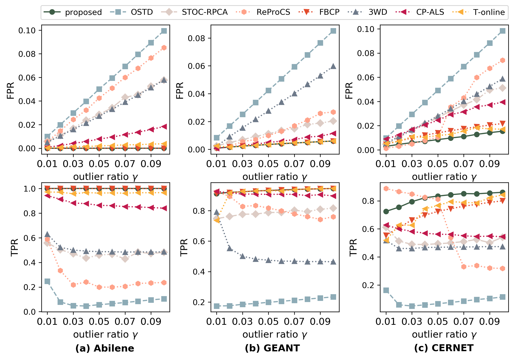
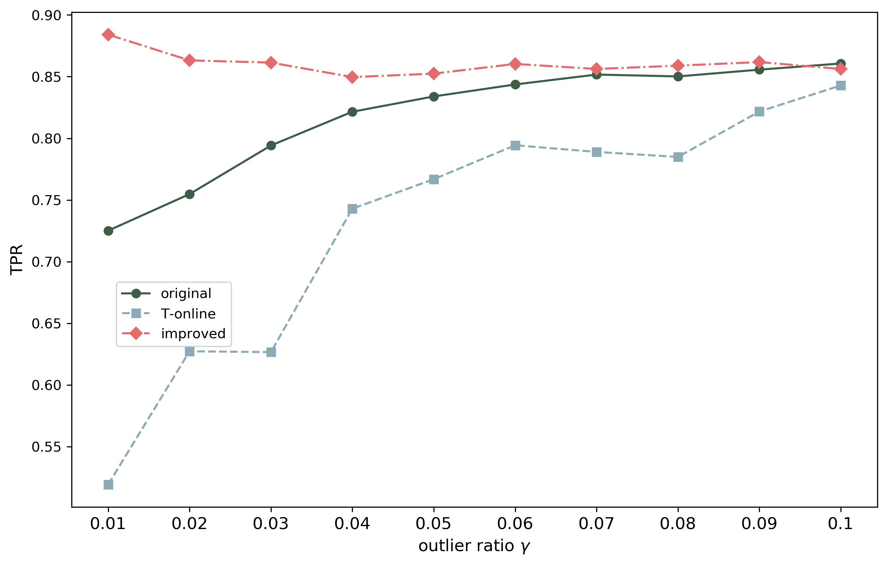

# VITAD-Fast-Online-Network-Traffic-Anomaly-Detection-Based-on-Variational-Inference
Paper code in "VITAD: Fast Online Network Traffic Anomaly Detection Based on Variational Inference".
# Dependencies
This project uses Python 3.7.3. Before running the code, you have to install
* [Scipy](https://www.scipy.org/)
* [Numpy](http://www.numpy.org/)
* [Matplotlib](https://matplotlib.org/)
* [Tensorly](http://tensorly.org/)

The dependencies can be installed using pip by running

```
pip install -r requirements.txt
```
# Experimental Results
We show the performence in three real traffic dataset Abilene, GEANT, CERNET on Under different standards.

### Results in different outliers ratio $\gamma$.


## Improved version takes full account of the periodicity in the traffic data.

